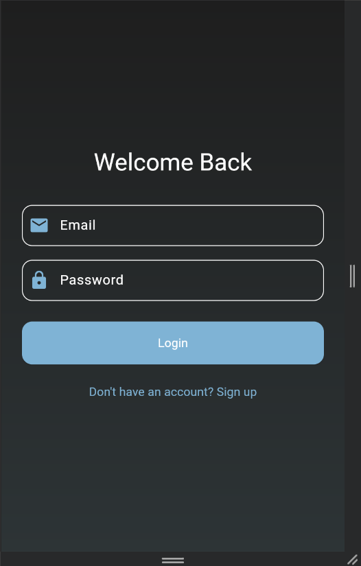
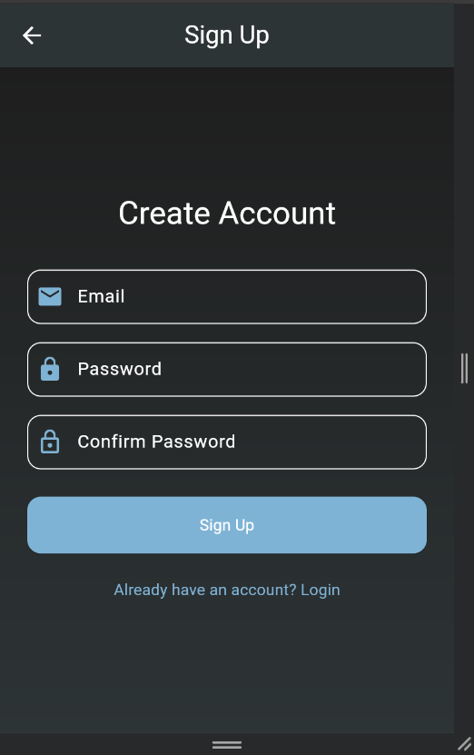
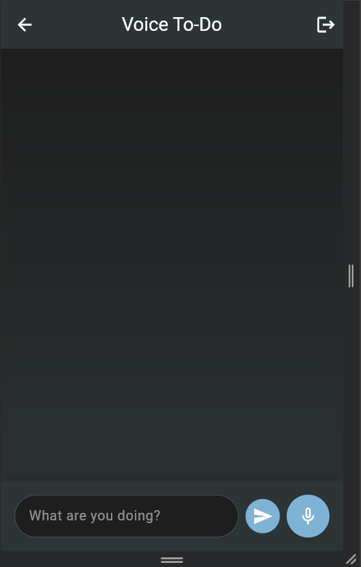
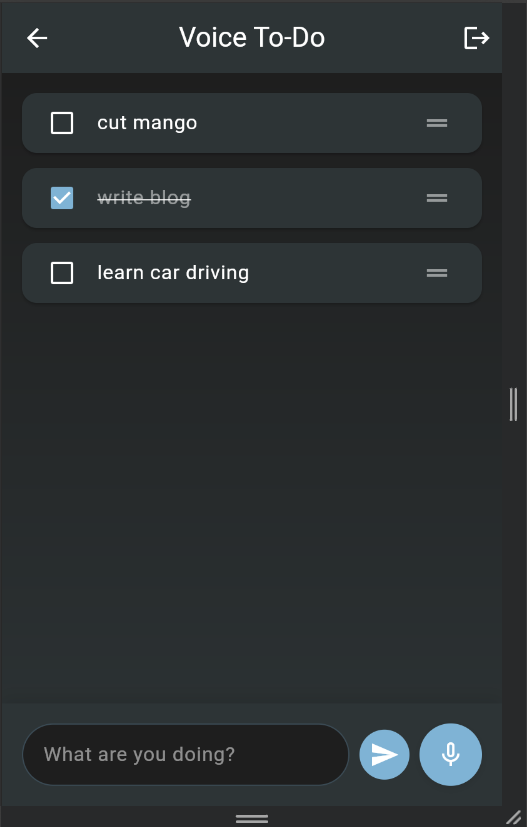

# 🎤 Voice-Driven To-Do List App

A modern, voice-enabled task management application built with Flutter that allows users to manage their tasks through voice commands and traditional input methods.


## ✨ Features

- **Voice Command Integration**
  - Add tasks using voice commands
  - Edit and delete tasks through voice
  - Offline voice capture capability
  - Real-time voice processing

- **Cross-Platform Support**
  - Works seamlessly on Android and iOS
  - Responsive design for all screen sizes
  - Consistent user experience across devices

- **Task Management**
  - Create, edit, and delete tasks
  - Mark tasks as complete/incomplete
  - Set due dates and priorities
  - Organize tasks into categories

- **User Authentication**
  - Secure login and signup
  - Local storage with Hive
  - Offline access to tasks
  - Data synchronization across devices

- **Modern UI/UX**
  - Clean and intuitive interface
  - Dark/Light theme support
  - Smooth animations and transitions
  - Material Design 3 components

## 🚀 Getting Started

### Prerequisites

- Flutter SDK (latest version)
- Dart SDK (latest version)
- Android Studio / VS Code
- Android/iOS device or emulator

### Installation

1. Clone the repository:
```bash
git clone https://github.com/KathrotiyaPrushti/VOICE-DRIVEN-TO-DO-APP
```

2. Navigate to the project directory:
```bash
cd VOICE-DRIVEN-TO-DO-APP
```

3. Install dependencies:
```bash
flutter pub get
```

4. Run the app:
```bash
flutter run
```

## 🛠️ Technical Stack

- **Frontend**: Flutter
- **State Management**: Provider
- **Local Storage**: Hive
- **Voice Processing**: Speech to Text
- **UI Components**: Material Design 3
- **Architecture**: Clean Architecture

## 📱 Screenshots

| Login Screen| SignUp Screen | Home Screen | Task Creation |
|-------------|---------------|-------------|---------------|
|  |  |  |  |

## 🤝 Contributing

Contributions are welcome! Please feel free to submit a Pull Request.

1. Fork the repository
2. Create your feature branch (`git checkout -b feature/AmazingFeature`)
3. Commit your changes (`git commit -m 'Add some AmazingFeature'`)
4. Push to the branch (`git push origin feature/AmazingFeature`)
5. Open a Pull Request

## 📄 License

This project is licensed under the MIT License - see the [LICENSE](LICENSE) file for details.

## 👨‍💻 Author

Prushti Kathrotiya - https://github.com/KathrotiyaPrushti

## 🙏 Acknowledgments

- Flutter team for the amazing framework
- Material Design team for the beautiful components
- All contributors who have helped shape this project

## 📞 Contact

- Email: prushtikathrotiya@gmail.com
- LinkedIn: www.linkedin.com/in/prushti-kathrotiya-381047252

---

Made with ❤️ using Flutter
